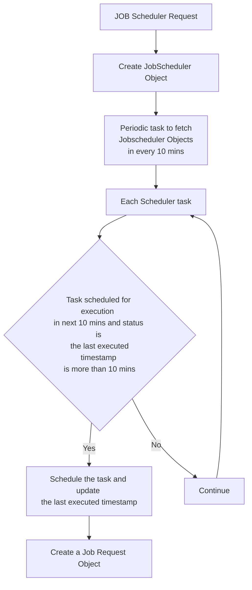



```mermaid
graph TD; 
A[JOB Scheduler Request]-->B; 

B[Create JobScheduler Object]-->C; 

C[Periodic task to fetch  <br/>Jobscheduler Objects  <br/>in every 10 mins]-->D;

D[Each Scheduler task] --> E

E{Task scheduled for execution  <br/>in next 10 mins and status is <br/> the last executed timestamp <br/>is more than 10 mins} --> |Yes|F;
E --> |No|G
G[Continue] --> D;

F[Schedule the task and update <br/>the last executed timestamp] --> H[Create a Job Request Object];


```
